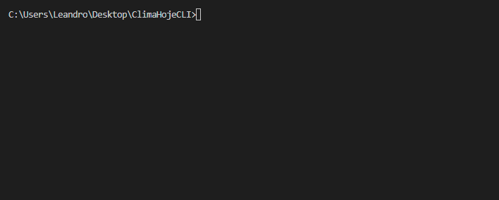

# ClimaHojeCLI
Cópia de um outro projeto meu, o [ClimaHoje](https://github.com/LeandroLS/ClimaHoje), só que esse é um CLI.

### Como usar
Acesse a raiz do projeto via terminal, e rode o comando `node climahoje -c "[nomedacidade]"`.

